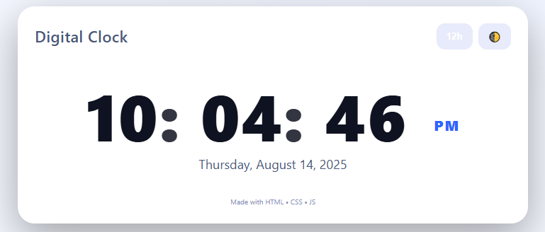
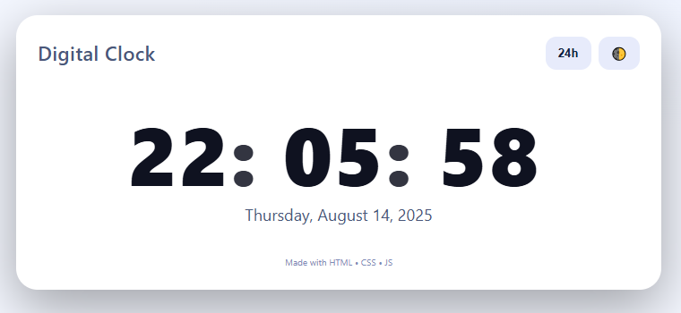

  <table align="center">
    <tr>
      <td> &nbsp;&nbsp;&nbsp;</td>
      <td>&nbsp;&nbsp;&nbsp;</td>   
    </tr>
  </table>

  <table align="center">
    <tr>
      <td> &nbsp;&nbsp;&nbsp;</td>
      <td> &nbsp;&nbsp;&nbsp;</td>      
    </tr>
  </table>

# A Digital clock 
## Made with HTML , CSS & JS ❤
